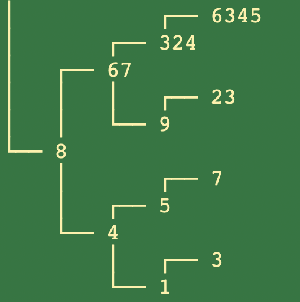

# 0️⃣1️⃣ 🔍 🌲 Binary Search Tree

Binary Search Tree for The Odin Project Curriculum

## 🗣️ Description

Custom Binary Search Tree for The Odin Project's curriculum.

This Binary Search Tree employs JS classes and methods that allow the user to manipulate the trees nodes, check the tree's balance, etc.

## 👨‍💻 Technologies Used

- JavaScript

## 👨‍🔬 BST Methods

- `insert(value)` / `delete(value)` - insert/delete the given value

- `find(value)` - returns the node with the given value

- `levelOrderForEach(callback)` - traverses the tree in breadth-first level order and calls the callback on each node as it traverses

- `inOrderForEach(callback)` / `preOrderForEach(callback)` / `postOrderForEach(callback)` - traverse the tree in their respective depth-first order and pass each node to the provided callback

- `height(value)` - returns the height of the node containing the given value

- `depth(value)` - returns the depth of the node containing the given value

- `isBalanced` - checks if the tree is balanced

- `rebalance` - rebalances an unbalanced tree

- `bstScript` - driver script that calls each method synchronously

- `prettyPrint` - prints BST in the console

Please Note: Method descriptions are a direct reflection of The Odin Project's "Binary Search Trees" assignement found [here](https://www.theodinproject.com/lessons/javascript-binary-search-trees).

Additional Note: `prettyPrint` function provided by The Odin Project.

## To Run:

```
git clone https://github.com/samsdevlab/binary-search-tree.git
cd binary-search-tree
node main.js
```

`node main.js` will run the driver script and provide a demo of output to the terminal

If you’d like to run files directly as executables instead of using node, you can increase permissions with:

```
chmod u+x main.js
chmod u+x bst.js
```

For additional information about running JavaScript files directly from the command line using the node command, click [here](https://github.com/nodejs/nodejs.dev/blob/aa4239e87a5adc992fdb709c20aebb5f6da77f86/content/learn/command-line/node-run-cli.en.md).

## Screenshots:




